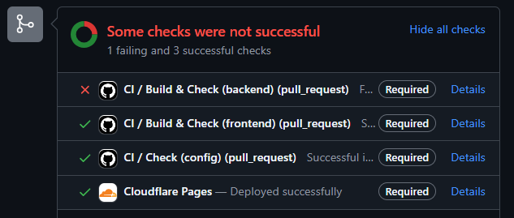
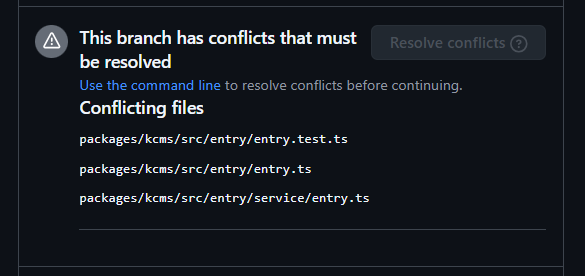

# 開発者向けガイド
## Getting Started
### 事前に準備するもの
- [Node.js](https://nodejs.org/en/) v22(その時のstableを使用してください)
- [pnpm](https://pnpm.io/ja/) 9.9
- [Git](https://git-scm.com/downloads)
- [bun](https://bun.sh/)

## インストール
```
git clone https://github.com/poporonnet/kcmsx
cd kcmsx
pnpm i
```

## 実行について
それぞれ別のターミナルを開いて実行してください

### フロントエンド
```
pnpm dev:frontend
```
http://localhost:5173 をブラウザで開いて使用できます。

### バックエンド
バックエンドの起動には事前にセットアップを行なっておく必要があります。

[バックエンドの環境構築](../packages/kcms/README.md)

```
pnpm dev:backend
```

### その他のコマンド
#### フォーマット
kcmsxのルートで実行でき、バックエンド、フロントエンド、モックのコードがフォーマットされます。
```
pnpm format
```

### 構文チェック
kcmsxのルートで実行でき、バックエンド・フロントエンドのコードをESLintを用いて構文チェックを行います。
```
pnpm lint
```

# kcmsxの構造
kcmsxは、モノレポを採用しており、packagesフォルダの中に、以下のパッケージが含まれています。
- [config](./packages/config/) kcmsx各種パッケージのための共通の設定ファイルを記述するパッケージ
- [kcms](./packages/kcms/) バックエンド
- [kcmsf](./packages/kcmsf/) フロントエンド
- [mock](./packages/mock/) バックエンドが完成するまで暫定で使われていたmock

## [APIリファレンス](./api.md)
バックエンドが提供するAPIの定義。

# ブランチ/コミット/Issue/Pull Request命名規則
プルリクエスト、コミット、Issueの名前は以下のようにしてください。
ただ、そこまで厳密に考えなくても大丈夫です。

`<type>: <title>` (例: `feat: Q＆Aページの作成`)  
- type:
  - `fix`: バグ修正、内容の更新、依存関係の更新 など
  - `feat`: 新しいページの作成、新しい機能の追加 など
  - `chore`: 軽微な修正(タイプミス修正など)
  - `refactor`: リファクタリング(プログラム内部の改善)
  - `docs`: ドキュメント関連の作業 など
- title:
  - 短い言葉で、内容を書いてください。

ブランチの名前は以下のようにしてください。  
`<type>/<issue-number>-<title>` (例: `feat/10-q-and-a`)
- type:
  - 上と同じです。
- issue-number:
  - Issue番号を書いてください。
  - 複数のIssueにまたがっている場合は、どちらか片方の番号を書いてください。
- title:
  - 基本的には上と同じです。
  - 適切な位置でハイフンを入れることをおすすめします。

## プルリクエストについて確認してほしい事項
### プルリクエストを作成するとき
プルリクエストを作成する際は、作業した内容をわかりやすくタイトルとコメントを用いて説明してください。

また、最初のコメントには、`Close #<issue-number>`という内容を記載してください。これを書くことで、プルリクエストとissueを関連づけることができ、このプルリクエストが完了したときに、関連付けられたissueが自動的にCloseされます。

例: https://github.com/poporonnet/kcmsx/pull/191

### プルリクエストを作成したあと
#### 自動テスト
プルリクエストを作成したあと、自動テストが実行されます。自動テストが成功するか確認をしてください。

↓実際に失敗してる例



テストが落ちたら`Details`からログが確認できるので、原因を調べて修正してください。

Cloudflareのビルドが落ちた場合、現状ログに関してはPoporon Networkのメンバーしか確認できないようになっています。
ビルドログの確認をしたい場合は、いずれかのメンバーにコンタクトをとって相談してください。

https://poporon.org/#Members

#### コンフリクト
また、コンフリクトが発生した場合、以下の表示がされています。こちらについても修正してください。



具体的な修正方法は、`Use the command line`を開いたときにわかりやすい説明が表示されるので、そちらを参考にしてみてください。

# その他
実際に開発するときに、必要になるであろう事柄について、いくつか記述します。ここは必要に応じて読んでください。

## APIを叩く
REST APIを叩いたことがない人向けの資料
[httpie.md](./httpie.md)
