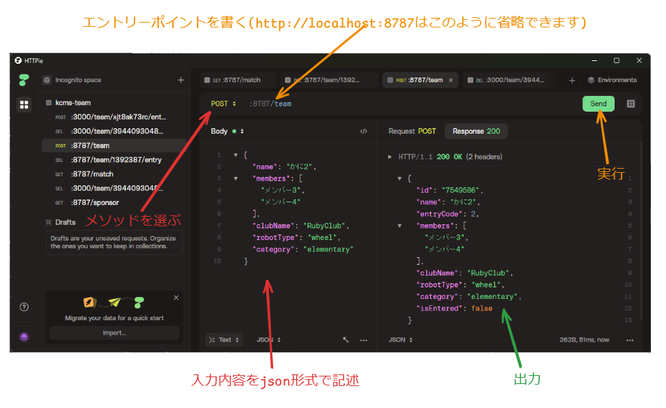

# HTTPieの使い方

フロントエンドの開発の際、バックエンドのAPIを叩く際に、どのように叩いて何が返ってくるかを実際に確認したいときがあると思います。

そのようなときに、今の開発メンバーがよく用いているHTTPieを使った方法を説明します。

## インストール
https://httpie.io/ からインストールしてください。

## 使用方法
例として、チームを登録するAPIを叩く方法を書きます。

まず↓がそのAPI
## チームの登録
`POST /team`
#### 入力
```jsonc
{
  // チーム名
  "name": "かに2",
  // チームメンバー
  "members": [
    "メンバー3"
  ],
  // チームの所属するクラブ(string | "")
  "clubName": "RubyClub",
  // ロボットのタイプ (robotTypes 設定依存)
  "robotType": "wheel",
  // チームのカテゴリ (category 設定依存)
  "category": "elementary",
}
```

#### 出力 `200 OK`

この通りに操作してください

